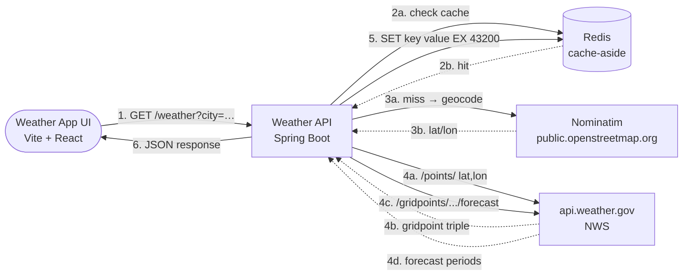
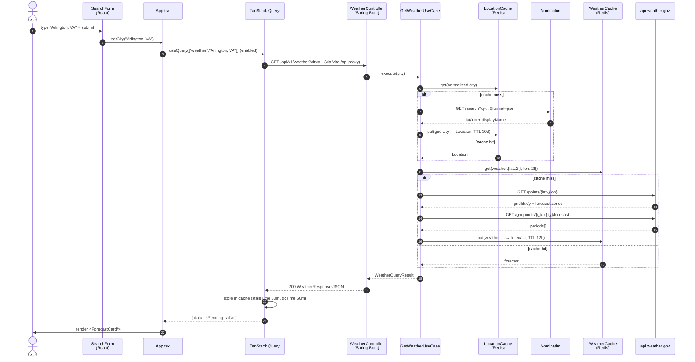
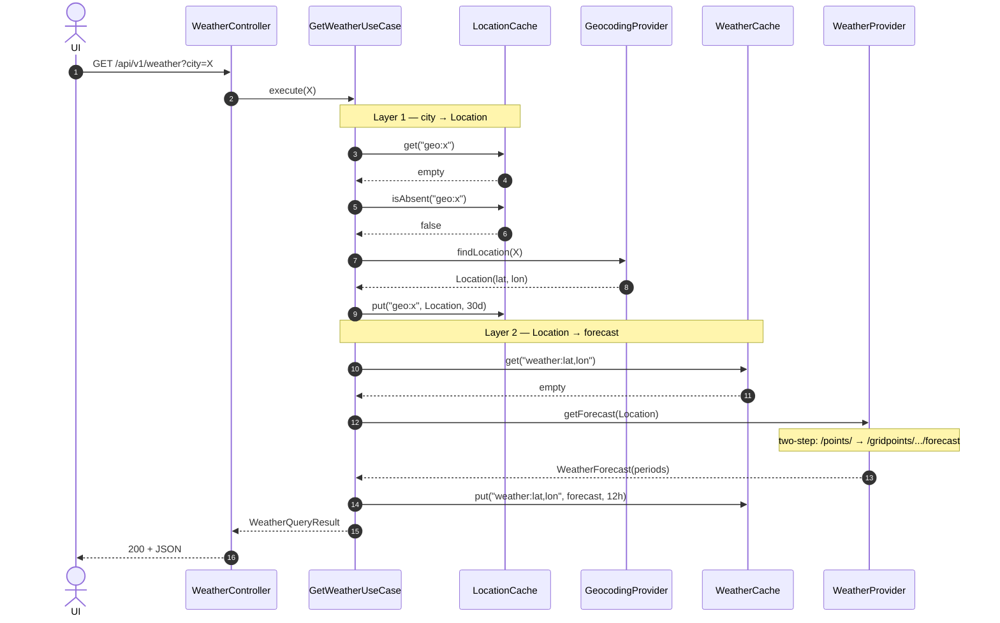
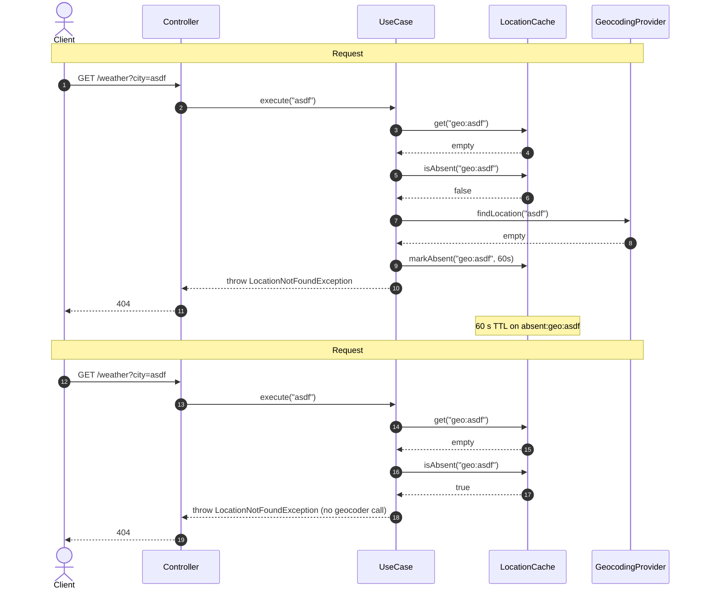

# Weather Wrapper Service

A Spring Boot wrapper around the [National Weather Service API](https://www.weather.gov/documentation/services-web-api)
with a Redis-backed **cache-aside** pattern for forecasts.

```
GET /api/v1/weather?city=Arlington,%20VA   →   forecast JSON
```

Geocoding (city → lat/lon) is delegated to [Nominatim](https://nominatim.openstreetmap.org/).
Cache keys are derived from the resolved location (lat/lon rounded to 2 decimals ≈ 1.1 km)
so trivial city-name variations share a slot.

---

## Architecture



### Request flow (two-layer cache-aside + negative caching)

1. **Geocoding cache lookup.** Cache key = `geo:{normalized-city}` where
   `normalized-city` = trimmed + lower-cased + whitespace-collapsed.
   So `Arlington, VA` / `arlington, va` / `  Arlington,  VA  ` all share
   one slot. Default TTL: 30 days (`weather.geocoding.cache.ttl`).
   - **Positive hit** → use the cached `Location`.
   - **Negative hit** (`isAbsent`) → return 404 without calling Nominatim.
   - **Miss** → call Nominatim, write through to cache.
2. **Weather cache lookup.** Cache key = `weather:{lat:.2f},{lon:.2f}` (e.g., `weather:38.88,-77.09`).
   Default TTL: 12 h (`weather.cache.ttl`).
   - **Hit** → return the cached forecast.
   - **Miss** → continue.
3. **Two-step NWS call**: `/points/{lat},{lon}` → gridpoint triple, then `/gridpoints/{gridId}/{x},{y}/forecast`.
4. **SET** the forecast under the weather key with the weather cache TTL.
5. Return the forecast.

### Negative caching (geocoding)

On a Nominatim miss (city not found), the cache records `absent:geo:{normalized-city}`
with a short TTL (default 60 s, `weather.geocoding.cache.absent-ttl`). Subsequent
requests for the same unknown city within that window return 404 without touching
Nominatim. Protects against bad-city floods (typos, scanner probes, scripted abuse)
that would otherwise exhaust the ~1 req/s Nominatim rate limit.

---

## Use case sequences

Trace each use case as a sequence diagram — the dependency wiring and
branching are easier to follow visually than reading the code alone.
As new use cases land in `weather-application/`, add a sub-section here
following the same pattern: happy-path diagram + path matrix + (optional)
focused diagrams for tricky branches.

### End-to-end UI request

Single submit → forecast rendered. Three cache layers along the way:
**TanStack Query** in the browser (keyed on city, 30 min), **Redis** in
the backend (geocoding 30 d + weather 12 h, plus negative caching on
misses), and **NWS** upstream (we don't cache NWS responses — Redis
backs the *wrapper's* responses).



#### Cache matrix

| Layer | Key | TTL | Hit effect |
|---|---|---|---|
| TanStack Query | `["weather", city]` | staleTime 30 min / gcTime 60 min | Instant re-render, no network |
| LocationCache (Redis) | `geo:{normalized-city}` | 30 d | Skips Nominatim |
| LocationCache (Redis) | `absent:geo:{normalized-city}` | 60 s | Skips Nominatim, returns 404 |
| WeatherCache (Redis) | `weather:{lat:.2f},{lon:.2f}` | 12 h | Skips both NWS calls |

### `GetWeatherUseCase`

Resolves a city name to a `Location`, then resolves that `Location` to a
`WeatherForecast`. Two-layer cache-aside with negative caching on the
geocoding layer. The code lives in
`backend/weather-application/.../usecase/GetWeatherUseCase.java`.

**Participants** (collaborators injected via constructor):

| Symbol | Role |
|---|---|
| `GeocodingProvider` | Port to Nominatim (city → Location) |
| `WeatherProvider` | Port to NWS (Location → forecast) |
| `LocationCache` | Redis, both positive (`geo:*`) and negative (`absent:geo:*`) entries |
| `WeatherCache` | Redis, positive (`weather:*`) entries |

#### Happy path: cold cache

Both caches miss on the first request for an unseen city. Every
collaborator is exercised — the most informative single diagram.



#### Path matrix

Every legal path through `execute(city)`. Use this as the source of
truth for "what happens if X" questions before reading the code.

| Scenario | `LocationCache.get` | `LocationCache.isAbsent` | Geocoder | `WeatherCache.get` | Weather | Result |
|---|---|---|---|---|---|---|
| Cold cache (above) | empty | false | called → Location | empty | called → forecast | 200 forecast |
| Geo cached, weather cached | hit | — | — | hit | — | 200 forecast |
| Geo cached, weather miss | hit | — | — | empty | called → forecast | 200 forecast |
| Geo miss → fresh, weather cached | empty | false | called → Location | hit | — | 200 forecast |
| City not found, first time | empty | false | called → empty (markAbsent) | — | — | 404 |
| City not found, within absent TTL | empty | true | — | — | — | 404 (from cache) |
| City not found, after absent TTL | empty | false | called again | — | — | 404 + re-mark |
| NWS down (any cache state) | (varies) | (varies) | (varies) | empty | throws | 502 |
| Blank / null `city` param | — | — | — | — | — | 400 (validation) |

#### Negative caching — protecting Nominatim

How the absent-cache layer turns a bad-city flood (typos, scanner probes,
scripted abuse) into a one-shot cost. Two requests for the same
unknown city within 60 s; the second one never reaches Nominatim.



---

## Tech stack

| Layer            | Choice                                                       |
|------------------|--------------------------------------------------------------|
| Language         | Java 21                                                      |
| Framework        | Spring Boot 3.3.5 (web, validation, actuator, data-redis)    |
| Build            | Maven (multi-module)                                         |
| Cache            | Redis 7 via Spring Data Redis (Lettuce)                      |
| HTTP client      | Spring `RestClient` (Spring Framework 6.1+)                  |
| Geocoding        | Public Nominatim (no key, rate-limited to ~1 req/s)          |
| Weather          | NWS `api.weather.gov` (no key, US-only, lat/lon, requires UA)|
| Tests            | JUnit 5, Mockito, AssertJ, WireMock 3, Testcontainers (Redis)|
| Containerization | Multi-stage Docker (Maven 3.9 + Temurin 21 JRE)              |

---

## Module layout

```
backend/
├── pom.xml                          # Parent POM (dependency & plugin management)
├── weather-domain/                  # Pure domain: value objects, port interfaces, exceptions
│   └── src/main/java/io/ythalorossy/weatherapi/domain/
│       ├── model/                   # Location, Temperature, ForecastPeriod, WeatherForecast
│       ├── port/                    # GeocodingProvider, WeatherProvider, WeatherCache
│       └── exception/               # LocationNotFoundException, WeatherProviderUnavailableException
│
├── weather-application/             # Use cases (plain Java, no Spring)
│   └── src/main/java/io/ythalorossy/weatherapi/application/
│       └── usecase/                 # GetWeatherUseCase + WeatherQueryResult
│
├── weather-infrastructure/          # Adapters implementing domain ports
│   └── src/main/java/io/ythalorossy/weatherapi/infrastructure/
│       ├── config/                  # WeatherProperties, RestClientConfig
│       ├── geocoding/               # NominatimGeocodingProvider + DTOs
│       ├── weather/                 # NwsWeatherProvider + DTOs
│       └── cache/                   # RedisWeatherCache
│
└── weather-api/                     # Spring Boot application: REST controller, config, entry point
    └── src/main/java/io/ythalorossy/weatherapi/api/
        ├── WeatherApiApplication.java
        ├── controller/              # WeatherController
        ├── dto/                     # WeatherResponse
        ├── exception/               # GlobalExceptionHandler (RFC 9457 ProblemDetail)
        └── config/                  # UseCaseConfig (wires plain-Java use case into Spring)

web/                                 # UI placeholder (React later)
```

The dependency graph is strictly one-way:
`domain ← application ← infrastructure` and `domain, application, infrastructure ← api`.
Domain has no Spring, no Jackson, no Redis — just Java.

---

## Running locally

### Backend

**With Docker** (recommended — handles Java, Maven, Redis):

```bash
docker compose up --build
```

The API comes up on `http://localhost:8080`. Redis is on `localhost:6379`.

### Frontend (Vite + React)

The `web/` directory is a standalone Vite app that calls the backend at `/api/v1/weather`.
Vite proxies `/api` to `http://localhost:8080`, so you must have the backend running first.

```bash
cd web
npm install
npm run dev          # http://localhost:5173
npm run build        # type-check + production bundle into dist/
```

Open <http://localhost:5173>, type a city (e.g. `Arlington, VA`), and the forecast appears.

```bash
# Sanity check
curl http://localhost:8080/actuator/health

# Get a forecast
curl 'http://localhost:8080/api/v1/weather?city=Arlington,%20VA'
```

### Without Docker (requires Java 21 + Maven 3.9 on the host)

```bash
# Start Redis any way you like, e.g.:
docker run -d -p 6379:6379 --name redis redis:7-alpine

# Build & run
cd backend
mvn -DskipTests package
java -jar weather-api/target/weather-api-*.jar
```

---

## Configuration

All settings live under the `weather.*` tree in `application.yml` and can be
overridden via environment variables (Spring Boot relaxed binding).

| Property                       | Default                            | Env var override         |
|--------------------------------|------------------------------------|--------------------------|
| `weather.cache.ttl`            | `12h`                              | `WEATHER_CACHE_TTL`      |
| `weather.provider.base-url`    | `https://api.weather.gov`          | `WEATHER_PROVIDER_BASE_URL` |
| `weather.provider.user-agent`  | `weather-wrapper-service/0.1.0 (…)` | `WEATHER_PROVIDER_USER_AGENT` |
| `weather.provider.timeout`     | `10s`                              | `WEATHER_PROVIDER_TIMEOUT` |
| `weather.geocoding.base-url`   | `https://nominatim.openstreetmap.org` | `WEATHER_GEOCODING_BASE_URL` |
| `weather.geocoding.user-agent` | `weather-wrapper-service/0.1.0 (…)` | `WEATHER_GEOCODING_USER_AGENT` |
| `weather.geocoding.timeout`    | `5s`                               | `WEATHER_GEOCODING_TIMEOUT` |
| `weather.geocoding.cache.ttl`  | `720h` (30 days)                   | `WEATHER_GEOCODING_CACHE_TTL` |
| `weather.geocoding.cache.absent-ttl` | `60s`                        | `WEATHER_GEOCODING_CACHE_ABSENT_TTL` |
| `spring.data.redis.host`       | `localhost`                        | `REDIS_HOST`             |
| `spring.data.redis.port`       | `6379`                             | `REDIS_PORT`             |
| `server.port`                  | `8080`                             | `SERVER_PORT`            |

**Why a User-Agent?** Both NWS and Nominatim require a descriptive `User-Agent`
identifying the caller. NWS returns `403` without one; Nominatim will silently
rate-limit you into oblivion. Change it to your own contact info for any
non-toy deployment.

---

## API

The full machine-readable spec is served by springdoc-openapi:

| URL                                       | Purpose                          |
|-------------------------------------------|----------------------------------|
| <http://localhost:8080/v3/api-docs>       | OpenAPI 3 spec, JSON             |
| <http://localhost:8080/v3/api-docs.yaml>  | OpenAPI 3 spec, YAML             |
| <http://localhost:8080/swagger-ui/index.html> | Interactive Swagger UI        |

### `GET /api/v1/weather?city={city}`

| Status | When                                            | Body                                     |
|--------|-------------------------------------------------|------------------------------------------|
| `200`  | Success                                         | `WeatherResponse` (see below)            |
| `400`  | `city` is missing or blank                      | RFC 9457 `ProblemDetail`                 |
| `404`  | City not found by Nominatim                     | `ProblemDetail` with `city` property     |
| `502`  | NWS unreachable or returned a non-success status| `ProblemDetail`                          |

### Example response

```json
{
  "city": "Arlington, VA",
  "resolvedLocation": {
    "latitude": 38.8816,
    "longitude": -77.0910,
    "displayName": "Arlington, Arlington County, Virginia, United States"
  },
  "forecast": {
    "generatedAt": "2026-08-07T12:00:00Z",
    "source": "National Weather Service (api.weather.gov)",
    "periods": [
      {
        "name": "Today",
        "temperature": { "value": 85, "unit": "FAHRENHEIT", "formatted": "85°F" },
        "windSpeed": "5 mph",
        "windDirection": "NW",
        "shortForecast": "Sunny",
        "detailedForecast": "Sunny, with a high near 85. Northwest wind around 5 mph.",
        "daytime": true
      }
    ]
  }
}
```

---

## Testing

```bash
cd backend
mvn verify
```

Test layout:
- **Unit:** domain value objects, `GetWeatherUseCase` orchestration (mocked ports)
- **Adapter integration:** `RedisWeatherCache` (Testcontainers Redis),
  `NominatimGeocodingProvider` (WireMock), `NwsWeatherProvider` (WireMock)
- **Application integration:** `WeatherApiApplicationIT` — full Spring Boot context,
  MockMvc, mocked upstream ports + real Testcontainers Redis

---

## Tradeoffs & future work

| Decision                                  | Why                                                                   | When to revisit                          |
|-------------------------------------------|-----------------------------------------------------------------------|------------------------------------------|
| Public Nominatim (no self-host)           | Single-purpose geocoder; the product is the weather wrapper, not OSM  | Self-host Photon if traffic grows        |
| Lat/lon cache key (not city name)         | "Arlington VA" vs "arlington, va" share a slot; same coords = same forecast | If you add per-user context              |
| Two-layer cache (geo + weather)           | Nominatim rate-limits at ~1 req/s; caching city→location absorbs traffic | If traffic exceeds Redis capacity        |
| Negative caching (60 s TTL on geo misses) | Bad-city floods (typos, probes) would otherwise exhaust Nominatim's rate limit | Tighten to 10–30 s for hostile traffic |
| 12-hour weather TTL / 30-day geo TTL      | NWS forecast updates hourly; lat/lon for a city rarely changes        | Tighten to 30–60 min for production      |
| No single-flight / stampede protection    | Premature for a single-user wrapper                                   | Add Caffeine in-process + per-key locks if traffic warrants |
| Spring Boot over lighter frameworks       | Matches existing stack; mature Redis/HTTP/validation/observability    | Already optimal                          |

### Future enhancements

- **Reactive variant** on `WebClient` if you need higher concurrency without blocking threads
- **OpenAPI spec** generation via springdoc-openapi
- **Rate limiting** at the API layer (Bucket4j) to protect upstream
- **Metrics** in Micrometer + Prometheus format
- **React UI** in `web/` (Vite + TanStack Query, calling `/api/v1/weather`)

---

## License

TBD (add MIT/Apache-2.0 LICENSE file before going public).