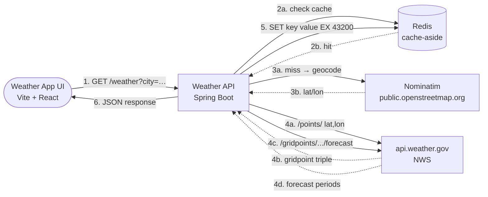

# Architecture

## Request flow (two-layer cache-aside + negative caching)

1. **Geocoding cache lookup.** Cache key = `geo:{normalized-city}` where
   `normalized-city` = trimmed + lower-cased + whitespace-collapsed.
   So `Arlington, VA` / `arlington, va` / `  Arlington,  VA  ` all share
   one slot. Default TTL: 30 days (`weather.geocoding.cache.ttl`).
   - **Positive hit** → use the cached `Location`.
   - **Negative hit** (`isAbsent`) → return 404 without calling Nominatim.
   - **Miss** → call Nominatim, write through to cache.
2. **Weather cache lookup.** Cache key = `weather:{lat:.4f},{lon:.4f}` (e.g., `weather:38.8816,-77.0910`).
   Default TTL: 12 h (`weather.cache.ttl`).
   - **Hit** → return the cached forecast.
   - **Miss** → continue.
3. **Two-step NWS call**: `/points/{lat},{lon}` → gridpoint triple, then `/gridpoints/{gridId}/{x},{y}/forecast`.
4. **SET** the forecast under the weather key with the weather cache TTL.
5. Return the forecast.

## Negative caching (geocoding)

On a Nominatim miss (city not found), the cache records `absent:geo:{normalized-city}`
with a short TTL (default 60 s, `weather.geocoding.cache.absent-ttl`). Subsequent
requests for the same unknown city within that window return 404 without touching
Nominatim. Protects against bad-city floods (typos, scanner probes, scripted abuse)
that would otherwise exhaust the ~1 req/s Nominatim rate limit.

