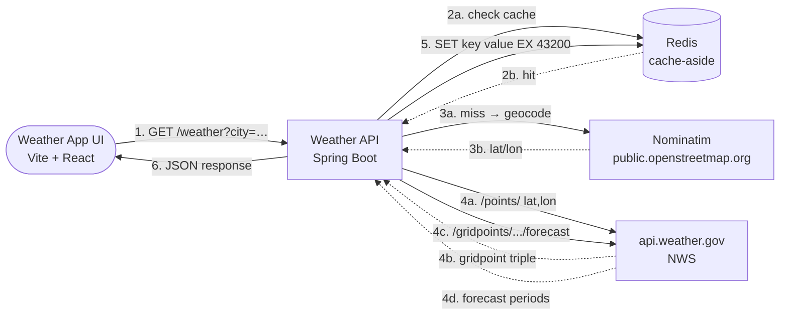
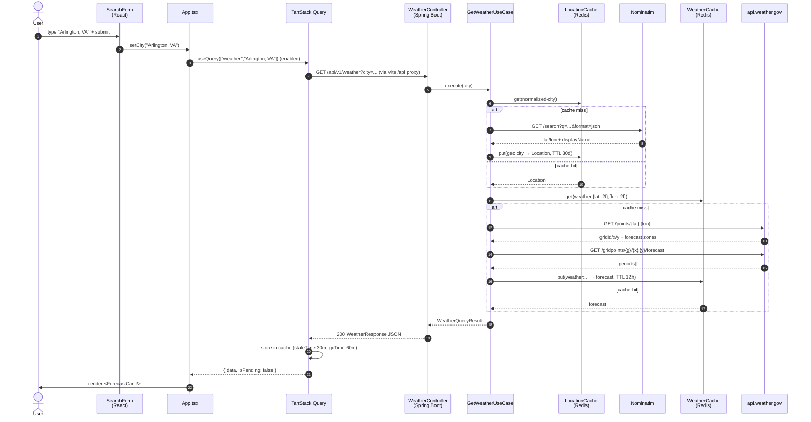
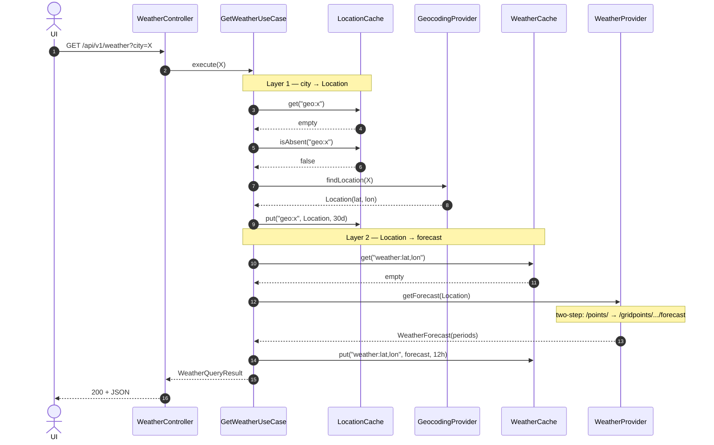
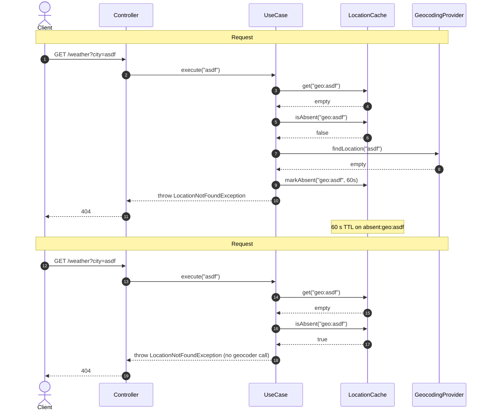

# Documentation Restructure Implementation Plan

> **For agentic workers:** REQUIRED SUB-SKILL: Use superpowers:subagent-driven-development (recommended) or superpowers:executing-plans to implement this plan task-by-task. Steps use checkbox (`- [ ]`) syntax for tracking.

**Goal:** Split the monolithic `README.md` into a `docs/` folder with one file per section, add `docs/superpowers/specs/` and `docs/superpowers/plans/`, and reduce `README.md` to a short overview + TOC.

**Architecture:** Create a flat `docs/` folder. Extract each README section into its own Markdown file using a "copy from line range" approach. Create a new `docs/ui.md` for UI-specific content. Replace `README.md` with a short version. Commit each extraction as a separate commit to keep history clean.

**Tech Stack:** Markdown, git, bash.

## Global Constraints

- No code changes; only documentation.
- Preserve all original content verbatim except for heading-level adjustments: the top-level section heading becomes `#`, subsections remain `##`.
- All relative links in new files must resolve (no broken links).
- Each extraction is one commit (keeps history clean and reversible).
- No placeholders, TODOs, or "TBD" in any new file.

## File Structure

```
weather-wrapper-service/
├── README.md                # Short overview + TOC (modified)
├── docs/
│   ├── architecture.md      # NEW — from README "Architecture"
│   ├── use-cases.md         # NEW — from README "Use case sequences"
│   ├── tech-stack.md        # NEW — from README "Tech stack"
│   ├── module-layout.md     # NEW — from README "Module layout"
│   ├── ui.md                # NEW — synthesized UI content
│   ├── running.md           # NEW — from README "Running locally"
│   ├── configuration.md     # NEW — from README "Configuration"
│   ├── api.md               # NEW — from README "API"
│   ├── testing.md           # NEW — from README "Testing"
│   ├── observability.md     # NEW — from README "Observability"
│   ├── rate-limiting.md     # NEW — from README "Rate limiting"
│   ├── concurrency.md       # NEW — from README "Concurrency model"
│   ├── tradeoffs.md         # NEW — from README "Tradeoffs & future work" + "Future enhancements"
│   ├── milestones.md        # NEW — from README "Milestones"
│   └── superpowers/
│       ├── specs/           # already exists
│       └── plans/           # this file lives here
```

---

## Task 1: Create docs/ directory structure

**Files:**
- Create: `docs/`
- Create: `docs/superpowers/plans/` (already exists; verify)

- [ ] **Step 1: Create docs/ at repo root**

Run: `mkdir -p docs`
Expected: docs/ directory created.

- [ ] **Step 2: Verify superpowers dirs exist**

Run: `ls -la docs/superpowers`
Expected: `specs/` and `plans/` directories present.

- [ ] **Step 3: Commit directory creation**

```bash
git add docs/
git commit -m "chore(docs): create docs/ directory tree"
```

---

## Task 2: Extract Milestones → docs/milestones.md

**Files:**
- Create: `docs/milestones.md`
- Source: `README.md` lines 16–74

- [ ] **Step 1: Read the source range**

Run: `sed -n '16,74p' README.md`
Expected: The "Milestones" section including M1, M2, M3, M4 subsections.

- [ ] **Step 2: Create docs/milestones.md**

Create the file with the following content (adapt heading `## Milestones` to `# Milestones`; keep `### M1` etc. as `## M1`):

```markdown
# Milestones

| Milestone | Status | Summary |
|---|---|---|
| **M1** — Forecast expansion | ✅ Done | Daily + hourly forecast, WFO metadata, all with Redis cache-aside |
| **M2** — Observations + alerts | ✅ Done | Current conditions (10 min cache), active alerts (5 min cache), severity colors in UI |
| **M3** — Multi-location + chart polish | 🟡 Next | localStorage saved locations, hand-rolled hourly temperature SVG chart |
| **M4** — Polish & niche (optional) | ○ Future | Radar station nearby, AFD text, glossary tooltips |

## M1 — Forecast expansion ✅ (2026-08-08)

| Endpoint | Cache TTL | Key |
|---|---|---|
| `GET /api/v1/weather?city=…` (daily) | 12 h | `weather:{lat:.2f},{lon:.2f}` |
| `GET /api/v1/weather/hourly?city=…` | 12 h | `hourly:{lat:.2f},{lon:.2f}` |
| `GET /api/v1/weather/metadata?city=…` | 7 d | `office:{officeId}` |

**Backend:** `GetHourlyForecastUseCase`, `GetLocationMetadataUseCase`, Redis adapters,
`RedisHourlyForecastCache`, `RedisLocationMetadataCache`, `NwsOfficeMetadataProvider`.

**Frontend:** `ForecastTabs` component (Daily / Hourly tabs), `MetadataBar` with WFO name
and NWS attribution. TanStack Query hooks: `useWeatherQuery`, `useHourlyWeather`,
`useLocationMetadata`.

**Note:** sunrise/sunset data types exist in the domain layer but are not yet wired
to an NWS endpoint — deferred to the M3 bundle.

## M2 — Observations + alerts ✅ (2026-08-09)

| Endpoint | Cache TTL | Key |
|---|---|---|
| `GET /api/v1/conditions?city=…` | 10 min | `obs:{stationId}` |
| `GET /api/v1/alerts?city=…` | 5 min | `alerts:{lat:.2f},{lon:.2f}` |

**Backend:** `GetCurrentConditionsUseCase`, `GetActiveAlertsUseCase`,
`NwsObservationProvider`, `NwsAlertProvider`, `RedisObservationCache`, `RedisAlertCache`.
Domain model: `Observation`, `WeatherAlert`, CAP-IP severity/certainty/urgency/category
enums.

**Frontend:** `CurrentConditionsCard` (temp, wind, humidity, pressure), `AlertsBanner`
(most severe alert with dismiss), `AlertList` (all alerts with severity color coding).
TanStack Query hooks: `useCurrentConditions`, `useAlerts`.

## M3 — Multi-location + chart polish 🟡 Next

- **Saved locations:** `localStorage`-backed location list — client-side only, no server
  state changes. "Save this location" button on the forecast header.
- **Hourly temperature chart:** hand-rolled SVG line chart (no extra dependency) —
  temperature vs. time for the next 24–48 hours. Embedded in the Hourly tab.
- **Sunrise/sunset wiring:** `SunTimes` domain types exist but are not yet connected to an
  NWS endpoint; surface them in the UI once wired.

## M4 — Polish & niche ○ Future

- Radar station nearby (NWS radar station lookup)
- Area Forecast Discussion (AFD) — raw NWS forecast discussion text
- Glossary tooltips for weather terms
```

- [ ] **Step 3: Verify content matches**

Run: `diff <(sed -n '16,74p' README.md | sed 's/^## /# /; s/^### /## /') docs/milestones.md`
Expected: No diff output (files match after heading adjustment).

- [ ] **Step 4: Commit**

```bash
git add docs/milestones.md
git commit -m "docs: extract Milestones section into docs/milestones.md"
```

---

## Task 3: Extract Architecture → docs/architecture.md

**Files:**
- Create: `docs/architecture.md`
- Source: `README.md` lines 76–123

- [ ] **Step 1: Read the source range**

Run: `sed -n '76,123p' README.md`
Expected: Architecture flowchart + request flow + negative caching sections.

- [ ] **Step 2: Create docs/architecture.md**

Create the file with the following content (adapt `## Architecture` to `# Architecture`; keep `### Request flow`, `### Negative caching` as `## Request flow`, `## Negative caching`):

```markdown
# Architecture



## Request flow (two-layer cache-aside + negative caching)

1. **Geocoding cache lookup.** Cache key = `geo:{normalized-city}` where
   `normalized-city` = trimmed + lower-cased + whitespace-collapsed.
   So `Arlington, VA` / `arlington, va` / `  Arlington,  VA  ` all share
   one slot. Default TTL: 30 days (`weather.geocoding.cache.ttl`).
   - **Positive hit** → use the cached `Location`.
   - **Negative hit** (`isAbsent`) → return 404 without calling Nominatim.
   - **Miss** → call Nominatim, write through to cache.
2. **Weather cache lookup.** Cache key = `weather:{lat:.2f},{lon:.2f}` (e.g., `weather:38.88,-77.09`).
   Default TTL: 12 h (`weather.cache.ttl`).
   - **Hit** → return the cached forecast.
   - **Miss** → continue.
3. **Two-step NWS call**: `/points/{lat},{lon}` → gridpoint triple, then `/gridpoints/{gridId}/{x},{y}/forecast`.
4. **SET** the forecast under the weather key with the weather cache TTL.
5. Return the forecast.

## Negative caching (geocoding)

On a Nominatim miss (city not found), the cache records `absent:geo:{normalized-city}`
with a short TTL (default 60 s, `weather.geocoding.cache.absent-ttl`). Subsequent
requests for the same unknown city within that window return 404 without touching
Nominatim. Protects against bad-city floods (typos, scanner probes, scripted abuse)
that would otherwise exhaust the ~1 req/s Nominatim rate limit.
```

- [ ] **Step 3: Verify content matches**

Run: `diff <(sed -n '76,123p' README.md | sed 's/^## /# /; s/^### /## /') docs/architecture.md`
Expected: No diff output.

- [ ] **Step 4: Commit**

```bash
git add docs/architecture.md
git commit -m "docs: extract Architecture section into docs/architecture.md"
```

---

## Task 4: Extract Use case sequences → docs/use-cases.md

**Files:**
- Create: `docs/use-cases.md`
- Source: `README.md` lines 125–309

- [ ] **Step 1: Read the source range**

Run: `sed -n '125,309p' README.md`
Expected: "Use case sequences" section including all sequence diagrams.

- [ ] **Step 2: Create docs/use-cases.md**

Create the file with the following content (adapt `## Use case sequences` to `# Use case sequences`; keep `### End-to-end UI request`, `### GetWeatherUseCase`, etc. as `##`):

```markdown
# Use case sequences

Trace each use case as a sequence diagram — the dependency wiring and
branching are easier to follow visually than reading the code alone.
As new use cases land in `weather-application/`, add a sub-section here
following the same pattern: happy-path diagram + path matrix + (optional)
focused diagrams for tricky branches.

## End-to-end UI request

Single submit → forecast rendered. Three cache layers along the way:
**TanStack Query** in the browser (keyed on city, 30 min), **Redis** in
the backend (geocoding 30 d + weather 12 h, plus negative caching on
misses), and **NWS** upstream (we don't cache NWS responses — Redis
backs the *wrapper's* responses).



### Cache matrix

| Layer | Key | TTL | Hit effect |
|---|---|---|---|
| TanStack Query | `["weather", city]` | staleTime 30 min / gcTime 60 min | Instant re-render, no network |
| LocationCache (Redis) | `geo:{normalized-city}` | 30 d | Skips Nominatim |
| LocationCache (Redis) | `absent:geo:{normalized-city}` | 60 s | Skips Nominatim, returns 404 |
| WeatherCache (Redis) | `weather:{lat:.2f},{lon:.2f}` | 12 h | Skips both NWS calls |

## `GetWeatherUseCase`

Resolves a city name to a `Location`, then resolves that `Location` to a
`WeatherForecast`. Two-layer cache-aside with negative caching on the
geocoding layer. The code lives in
`backend/weather-application/.../usecase/GetWeatherUseCase.java`.

**Participants** (collaborators injected via constructor):

| Symbol | Role |
|---|---|
| `GeocodingProvider` | Port to Nominatim (city → Location) |
| `WeatherProvider` | Port to NWS (Location → forecast) |
| `LocationCache` | Redis, both positive (`geo:*`) and negative (`absent:geo:*`) entries |
| `WeatherCache` | Redis, positive (`weather:*`) entries |

### Happy path: cold cache

Both caches miss on the first request for an unseen city. Every
collaborator is exercised — the most informative single diagram.



### Path matrix

Every legal path through `execute(city)`. Use this as the source of
truth for "what happens if X" questions before reading the code.

| Scenario | `LocationCache.get` | `LocationCache.isAbsent` | Geocoder | `WeatherCache.get` | Weather | Result |
|---|---|---|---|---|---|---|
| Cold cache (above) | empty | false | called → Location | empty | called → forecast | 200 forecast |
| Geo cached, weather cached | hit | — | — | hit | — | 200 forecast |
| Geo cached, weather miss | hit | — | — | empty | called → forecast | 200 forecast |
| Geo miss → fresh, weather cached | empty | false | called → Location | hit | — | 200 forecast |
| City not found, first time | empty | false | called → empty (markAbsent) | — | — | 404 |
| City not found, within absent TTL | empty | true | — | — | — | 404 (from cache) |
| City not found, after absent TTL | empty | false | called again | — | — | 404 + re-mark |
| NWS down (any cache state) | (varies) | (varies) | (varies) | empty | throws | 502 |
| Blank / null `city` param | — | — | — | — | — | 400 (validation) |

### Negative caching — protecting Nominatim

How the absent-cache layer turns a bad-city flood (typos, scanner probes,
scripted abuse) into a one-shot cost. Two requests for the same
unknown city within 60 s; the second one never reaches Nominatim.


```

- [ ] **Step 3: Verify content matches**

Run: `diff <(sed -n '125,309p' README.md | sed 's/^## /# /; s/^### /## /') docs/use-cases.md`
Expected: No diff output.

- [ ] **Step 4: Commit**

```bash
git add docs/use-cases.md
git commit -m "docs: extract Use case sequences into docs/use-cases.md"
```

---

## Task 5: Extract Tech stack → docs/tech-stack.md

**Files:**
- Create: `docs/tech-stack.md`
- Source: `README.md` lines 313–326

- [ ] **Step 1: Read source range**

Run: `sed -n '313,326p' README.md`

- [ ] **Step 2: Create docs/tech-stack.md**

```markdown
# Tech stack

| Layer            | Choice                                                       |
|------------------|--------------------------------------------------------------|
| Language         | Java 21                                                      |
| Framework        | Spring Boot 3.3.5 (web, validation, actuator, data-redis)    |
| Build            | Maven (multi-module)                                         |
| Cache            | Redis 7 via Spring Data Redis (Lettuce)                      |
| HTTP client      | Spring `RestClient` (Spring Framework 6.1+)                  |
| Geocoding        | Public Nominatim (no key, rate-limited to ~1 req/s)          |
| Weather          | NWS `api.weather.gov` (no key, US-only, lat/lon, requires UA)|
| Tests            | JUnit 5, Mockito, AssertJ, WireMock 3, Testcontainers (Redis)|
| Containerization | Multi-stage Docker (Maven 3.9 + Temurin 21 JRE)              |
```

- [ ] **Step 3: Verify and commit**

```bash
diff <(sed -n '313,326p' README.md | sed 's/^## /# /') docs/tech-stack.md
git add docs/tech-stack.md
git commit -m "docs: extract Tech stack into docs/tech-stack.md"
```

---

## Task 6: Extract Module layout → docs/module-layout.md

**Files:**
- Create: `docs/module-layout.md`
- Source: `README.md` lines 329–364

- [ ] **Step 1: Read source range**

Run: `sed -n '329,364p' README.md`

- [ ] **Step 2: Create docs/module-layout.md**

```markdown
# Module layout

```
backend/
├── pom.xml                          # Parent POM (dependency & plugin management)
├── weather-domain/                  # Pure domain: value objects, port interfaces, exceptions
│   └── src/main/java/io/ythalorossy/weatherapi/domain/
│       ├── model/                   # Location, Temperature, ForecastPeriod, WeatherForecast
│       ├── port/                    # GeocodingProvider, WeatherProvider, WeatherCache
│       └── exception/               # LocationNotFoundException, WeatherProviderUnavailableException
│
├── weather-application/             # Use cases (plain Java, no Spring)
│   └── src/main/java/io/ythalorossy/weatherapi/application/
│       └── usecase/                 # GetWeatherUseCase + WeatherQueryResult
│
├── weather-infrastructure/          # Adapters implementing domain ports
│   └── src/main/java/io/ythalorossy/weatherapi/infrastructure/
│       ├── config/                  # WeatherProperties, RestClientConfig
│       ├── geocoding/               # NominatimGeocodingProvider + DTOs
│       ├── weather/                 # NwsWeatherProvider + DTOs
│       └── cache/                   # RedisWeatherCache
│
└── weather-api/                     # Spring Boot application: REST controller, config, entry point
    └── src/main/java/io/ythalorossy/weatherapi/api/
        ├── WeatherApiApplication.java
        ├── controller/              # WeatherController
        ├── dto/                     # WeatherResponse
        ├── exception/               # GlobalExceptionHandler (RFC 9457 ProblemDetail)
        └── config/                  # UseCaseConfig (wires plain-Java use case into Spring)

web/                                 # UI placeholder (React later)
```

The dependency graph is strictly one-way:
`domain ← application ← infrastructure` and `domain, application, infrastructure ← api`.
Domain has no Spring, no Jackson, no Redis — just Java.
```

- [ ] **Step 3: Verify and commit**

```bash
diff <(sed -n '329,364p' README.md | sed 's/^## /# /') docs/module-layout.md
git add docs/module-layout.md
git commit -m "docs: extract Module layout into docs/module-layout.md"
```

---

## Task 7: Extract Running locally → docs/running.md

**Files:**
- Create: `docs/running.md`
- Source: `README.md` lines 361–400 (Running locally section)

- [ ] **Step 1: Read source range**

Run: `sed -n '361,400p' README.md`

- [ ] **Step 2: Create docs/running.md**

```markdown
# Running locally

## Backend

**With Docker** (recommended — handles Java, Maven, Redis):

```bash
docker compose up --build
```

The API comes up on `http://localhost:8080`. Redis is on `localhost:6379`.

## Frontend (Vite + React)

The `web/` directory is a standalone Vite app that calls the backend at `/api/v1/weather`.
Vite proxies `/api` to `http://localhost:8080`, so you must have the backend running first.

```bash
cd web
npm install
npm run dev          # http://localhost:5173
npm run build        # type-check + production bundle into dist/
```

Open <http://localhost:5173>, type a city (e.g. `Arlington, VA`), and the forecast appears.

```bash
# Sanity check
curl http://localhost:8080/actuator/health

# Get a forecast
curl 'http://localhost:8080/api/v1/weather?city=Arlington,%20VA'
```

## Without Docker (requires Java 21 + Maven 3.9 on the host)

```bash
# Start Redis any way you like, e.g.:
docker run -d -p 6379:6379 --name redis redis:7-alpine

# Build & run
cd backend
mvn -DskipTests package
java -jar weather-api/target/weather-api-*.jar
```
```

- [ ] **Step 3: Verify and commit**

```bash
diff <(sed -n '361,400p' README.md | sed 's/^## /# /; s/^### /## /') docs/running.md
git add docs/running.md
git commit -m "docs: extract Running locally into docs/running.md"
```

---

## Task 8: Extract Configuration → docs/configuration.md

**Files:**
- Create: `docs/configuration.md`
- Source: `README.md` lines 416–439

- [ ] **Step 1: Read source range**

Run: `sed -n '416,439p' README.md`

- [ ] **Step 2: Create docs/configuration.md**

```markdown
# Configuration

All settings live under the `weather.*` tree in `application.yml` and can be
overridden via environment variables (Spring Boot relaxed binding).

| Property                       | Default                            | Env var override         |
|--------------------------------|------------------------------------|--------------------------|
| `weather.cache.ttl`            | `12h`                              | `WEATHER_CACHE_TTL`      |
| `weather.provider.base-url`    | `https://api.weather.gov`          | `WEATHER_PROVIDER_BASE_URL` |
| `weather.provider.user-agent`  | `weather-wrapper-service/0.1.0 (…)` | `WEATHER_PROVIDER_USER_AGENT` |
| `weather.provider.timeout`     | `10s`                              | `WEATHER_PROVIDER_TIMEOUT` |
| `weather.geocoding.base-url`   | `https://nominatim.openstreetmap.org` | `WEATHER_GEOCODING_BASE_URL` |
| `weather.geocoding.user-agent` | `weather-wrapper-service/0.1.0 (…)` | `WEATHER_GEOCODING_USER_AGENT` |
| `weather.geocoding.timeout`    | `5s`                               | `WEATHER_GEOCODING_TIMEOUT` |
| `weather.geocoding.cache.ttl`  | `720h` (30 days)                   | `WEATHER_GEOCODING_CACHE_TTL` |
| `weather.geocoding.cache.absent-ttl` | `60s`                        | `WEATHER_GEOCODING_CACHE_ABSENT_TTL` |
| `spring.data.redis.host`       | `localhost`                        | `REDIS_HOST`             |
| `spring.data.redis.port`       | `6379`                             | `REDIS_PORT`             |
| `server.port`                  | `8080`                             | `SERVER_PORT`            |

**Why a User-Agent?** Both NWS and Nominatim require a descriptive `User-Agent`
identifying the caller. NWS returns `403` without one; Nominatim will silently
rate-limit you into oblivion. Change it to your own contact info for any
non-toy deployment.
```

- [ ] **Step 3: Verify and commit**

```bash
diff <(sed -n '416,439p' README.md | sed 's/^## /# /') docs/configuration.md
git add docs/configuration.md
git commit -m "docs: extract Configuration into docs/configuration.md"
```

---

## Task 9: Extract API reference → docs/api.md

**Files:**
- Create: `docs/api.md`
- Source: `README.md` lines 443–534

- [ ] **Step 1: Read source range**

Run: `sed -n '443,534p' README.md`

- [ ] **Step 2: Create docs/api.md**

```markdown
# API

The full machine-readable spec is served by springdoc-openapi:

| URL                                       | Purpose                          |
|-------------------------------------------|----------------------------------|
| <http://localhost:8080/v3/api-docs>       | OpenAPI 3 spec, JSON             |
| <http://localhost:8080/v3/api-docs.yaml>  | OpenAPI 3 spec, YAML             |
| <http://localhost:8080/swagger-ui/index.html> | Interactive Swagger UI        |

## `GET /api/v1/weather?city={city}`

12-hour-block forecast (5–7 days, day+night periods).

| Status | When                                            | Body                                     |
|--------|-------------------------------------------------|------------------------------------------|
| `200`  | Success                                         | `WeatherResponse` (see below)            |
| `400`  | `city` is missing or blank                      | RFC 9457 `ProblemDetail`                 |
| `404`  | City not found by Nominatim                     | `ProblemDetail` with `city` property     |
| `502`  | NWS unreachable or returned a non-success status| `ProblemDetail`                          |

## `GET /api/v1/weather/hourly?city={city}`

Fine-grained hourly forecast (up to ~156 hours). Sibling to the daily endpoint above, served from the same NWS gridpoint pipeline but at a finer time resolution.

| Status | When                                            | Body                                     |
|--------|-------------------------------------------------|------------------------------------------|
| `200`  | Success                                         | `HourlyWeatherResponse`                  |
| `400`  | `city` is missing or blank                      | RFC 9457 `ProblemDetail`                 |
| `404`  | City not found by Nominatim                     | `ProblemDetail`                          |
| `502`  | NWS unreachable or returned a non-success status| `ProblemDetail`                          |

## `GET /api/v1/weather/metadata?city={city}`

NWS Weather Forecast Office (WFO) info for the resolved city: issuing office id, human-readable name, timezone, radar station, and forecast-office page URL. Used by the UI's "Forecast from NWS Baltimore/Washington · Sunrise 6:42, sunset 19:34" strip.

| Status | When                                            | Body                                     |
|--------|-------------------------------------------------|------------------------------------------|
| `200`  | Success                                         | `LocationMetadataResponse`               |
| `400`  | `city` is missing or blank                      | RFC 9457 `ProblemDetail`                 |
| `404`  | City not found by Nominatim                     | `ProblemDetail`                          |
| `502`  | NWS unreachable or returned a non-success status| `ProblemDetail`                          |

## `GET /api/conditions?city={city}`

Current conditions from the nearest NWS observation station. Returns the latest reported values: temperature, dewpoint, wind speed + direction, relative humidity, barometric pressure, free-text description, and the station attribution. 10-minute cache.

| Status | When                                            | Body                                     |
|--------|-------------------------------------------------|------------------------------------------|
| `200`  | Success (may have `observation: null` if no station found nearby) | `CurrentConditionsResponse` |
| `400`  | `city` is missing or blank                      | RFC 9457 `ProblemDetail`                 |
| `404`  | City not found by Nominatim                     | `ProblemDetail`                          |
| `502`  | NWS unreachable or returned a non-success status| `ProblemDetail`                          |

## `GET /api/v1/alerts?city={city}`

Active NWS weather alerts at the resolved city. Empty list (200, not 404) when no alerts are active. Each alert carries the CAP-IP severity / certainty / urgency / category plus headline, long-form description, recommended instructions, affected area, and validity window. 5-minute cache.

| Status | When                                            | Body                                     |
|--------|-------------------------------------------------|------------------------------------------|
| `200`  | Success (alerts list may be empty)              | `AlertsResponse`                          |
| `400`  | `city` is missing or blank                      | RFC 9457 `ProblemDetail`                 |
| `404`  | City not found by Nominatim                     | `ProblemDetail`                          |
| `502`  | NWS unreachable or returned a non-success status| `ProblemDetail`                          |

## Example response

```json
{
  "city": "Arlington, VA",
  "resolvedLocation": {
    "latitude": 38.8816,
    "longitude": -77.0910,
    "displayName": "Arlington, Arlington County, Virginia, United States"
  },
  "forecast": {
    "generatedAt": "2026-08-07T12:00:00Z",
    "source": "National Weather Service (api.weather.gov)",
    "periods": [
      {
        "name": "Today",
        "temperature": { "value": 85, "unit": "FAHRENHEIT", "formatted": "85°F" },
        "windSpeed": "5 mph",
        "windDirection": "NW",
        "shortForecast": "Sunny",
        "detailedForecast": "Sunny, with a high near 85. Northwest wind around 5 mph.",
        "daytime": true
      }
    ]
  }
}
```
```

- [ ] **Step 3: Verify and commit**

```bash
diff <(sed -n '443,534p' README.md | sed 's/^## /# /; s/^### /## /') docs/api.md
git add docs/api.md
git commit -m "docs: extract API reference into docs/api.md"
```

---

## Task 10: Extract Testing → docs/testing.md

**Files:**
- Create: `docs/testing.md`
- Source: `README.md` lines 536–548

- [ ] **Step 1: Read source range**

Run: `sed -n '536,548p' README.md`

- [ ] **Step 2: Create docs/testing.md**

```markdown
# Testing

```bash
cd backend
mvn verify
```

Test layout:
- **Unit:** domain value objects, `GetWeatherUseCase` orchestration (mocked ports)
- **Adapter integration:** `RedisWeatherCache` (Testcontainers Redis),
  `NominatimGeocodingProvider` (WireMock), `NwsWeatherProvider` (WireMock)
- **Application integration:** `WeatherApiApplicationIT` — full Spring Boot context,
  MockMvc, mocked upstream ports + real Testcontainers Redis
```
```

- [ ] **Step 3: Verify and commit**

```bash
diff <(sed -n '536,548p' README.md | sed 's/^## /# /') docs/testing.md
git add docs/testing.md
git commit -m "docs: extract Testing into docs/testing.md"
```

---

## Task 11: Extract Observability → docs/observability.md

**Files:**
- Create: `docs/observability.md`
- Source: `README.md` lines 554–606

- [ ] **Step 1: Read source range**

Run: `sed -n '554,606p' README.md`

- [ ] **Step 2: Create docs/observability.md**

```markdown
# Observability

Spring Boot Actuator exposes the Prometheus scrape endpoint at:

```
GET /actuator/prometheus    →  200, Prometheus exposition format
```

## Auto-collected metrics

Spring Boot + Micrometer + Lettuce give us a baseline for free:

| Metric prefix | What it covers |
|---|---|
| `http_server_requests_seconds` | Per-endpoint latency, count, status (auto from Spring MVC) |
| `jvm_memory_*`, `jvm_gc_*`, `jvm_threads_*` | JVM internals |
| `process_cpu_*`, `system_cpu_*` | CPU usage |
| `lettuce_command_*` | Redis client commands (auto, since Spring Boot uses Lettuce) |
| `logback_events_*` | Log counts by level |

## Custom metrics (weather_*)

Registered in the cache adapters and upstream providers:

| Metric | Type | Tags | Where |
|---|---|---|---|
| `weather_cache_location_total` | Counter | `result=hit|miss|negative_hit` | `RedisLocationCache` |
| `weather_cache_weather_total` | Counter | `result=hit|miss` | `RedisWeatherCache` |
| `weather_provider_geocoding_seconds` | Timer | `outcome=success|failure` | `NominatimGeocodingProvider` |
| `weather_provider_nws_seconds` | Timer | `outcome=success|failure` | `NwsWeatherProvider` |

Every metric carries the common tag `service=weather-wrapper-service` (set in `MetricsConfig`).

**Hit-ratio derivation:** `weather_cache_*{result="hit"} / (hit + miss)`. A negative cache hit also increments `miss`, so the math is consistent.

**Example:**

```bash
$ curl -s http://localhost:8080/actuator/prometheus | grep weather_

# HELP weather_cache_location_total Geocoding cache lookups by outcome
# TYPE weather_cache_location_total counter
weather_cache_location_total{result="hit"} 2.0
weather_cache_location_total{result="miss"} 1.0
weather_cache_location_total{result="negative_hit"} 0.0
# HELP weather_cache_weather_total Weather cache lookups by outcome
# TYPE weather_cache_weather_total counter
weather_cache_weather_total{result="hit"} 2.0
weather_cache_weather_total{result="miss"} 0.0
# HELP weather_provider_geocoding_seconds Time spent calling Nominatim
# TYPE weather_provider_geocoding_seconds summary
weather_provider_geocoding_seconds_count{outcome="success",service="weather-wrapper-service"} 1
```
```

- [ ] **Step 3: Verify and commit**

```bash
diff <(sed -n '554,606p' README.md | sed 's/^## /# /; s/^### /## /') docs/observability.md
git add docs/observability.md
git commit -m "docs: extract Observability into docs/observability.md"
```

---

## Task 12: Extract Rate limiting → docs/rate-limiting.md

**Files:**
- Create: `docs/rate-limiting.md`
- Source: `README.md` lines 608–690

- [ ] **Step 1: Read source range**

Run: `sed -n '608,690p' README.md`

- [ ] **Step 2: Create docs/rate-limiting.md**

```markdown
# Rate limiting

Bucket4j token buckets, distributed over Redis via Lettuce, applied to the
`/api/*` URL pattern only (actuator and Swagger UI are exempt).

## Configuration

```yaml
weather:
  rate-limit:
    enabled: true              # set false in tests so multi-request tests still pass
    burst:
      capacity: 5
      refill-period-seconds: 1
    sustained:
      capacity: 60
      refill-period-seconds: 60
```

Two-bandwidth limit per client IP:

| Bandwidth | Capacity | Refill | Why |
|---|---|---|---|
| **burst** | 5 | 5 tokens / second | Anti-hammer, Nominatim-friendly |
| **sustained** | 60 | 60 tokens / minute | Long-term cap |

A request consumes 1 token from *both* bandwidths; the more restrictive
decides. So a real user can burst 5 quick requests, but then must slow
to ~1/sec until the sustained bucket recovers (after ~60 seconds of
inactivity at full capacity).

## Client IP

Key is taken from `X-Forwarded-For` (first hop) → `request.getRemoteAddr()`
fallback. One bucket per IP, persisted in Redis with 10-minute TTL on
idle buckets so we don't accumulate one-off entries forever.

## 429 response

When a bucket is exhausted:

- HTTP `429 Too Many Requests`
- `Retry-After: <seconds>` header
- `X-RateLimit-Remaining: 0` header
- Body: RFC 9457 `ProblemDetail`

```json
{
  "type": "https://weather-wrapper-service.ythalorossy.io/errors/rate-limit-exceeded",
  "title": "Rate limit exceeded",
  "status": 429,
  "detail": "Rate limit exceeded. Try again in 1 seconds.",
  "properties": {
    "retryAfterSeconds": 1
  }
}
```

On allowed requests, the filter sets `X-RateLimit-Remaining: <count>`.

## Failure mode

If Redis is unreachable, the filter **fails open** (logs a warning and
allows the request through). Rate limiting is best-effort; a broken
limiter should not take down the API.

## Verification

```bash
$ for i in {1..7}; do curl -s -o /dev/null -w "req $i: HTTP %{http_code}\n" \
    "http://localhost:8080/api/v1/weather?city=Arlington,%20VA"; done
req 1: HTTP 200
req 2: HTTP 200
req 3: HTTP 200
req 4: HTTP 200
req 5: HTTP 200
req 6: HTTP 200        # burst refilled ~greedy during the loop
req 7: HTTP 429        # bucket exhausted, Retry-After: 1

$ curl -s -o /dev/null -w "%{http_code}\n" -H "X-Forwarded-For: 1.2.3.4" \
    "http://localhost:8080/api/v1/weather?city=Arlington,%20VA"
200                  # independent bucket per IP
```
```

- [ ] **Step 3: Verify and commit**

```bash
diff <(sed -n '608,690p' README.md | sed 's/^## /# /; s/^### /## /') docs/rate-limiting.md
git add docs/rate-limiting.md
git commit -m "docs: extract Rate limiting into docs/rate-limiting.md"
```

---

## Task 13: Extract Concurrency model → docs/concurrency.md

**Files:**
- Create: `docs/concurrency.md`
- Source: `README.md` lines 692–709

- [ ] **Step 1: Read source range**

Run: `sed -n '692,709p' README.md`

- [ ] **Step 2: Create docs/concurrency.md**

```markdown
# Concurrency model: virtual threads

Enabled via `spring.threads.virtual.enabled=true` in `application.yml`. Spring
Boot 3.2+ swaps Tomcat's request thread pool from platform threads to Java 21
virtual threads (Project Loom).

**What this means:**
- Blocking I/O on `RestClient` (Nominatim, NWS) parks the virtual thread cheaply (~1 KB stack) instead of holding an OS thread
- Same imperative code (controllers, use cases, providers) — no `Mono<T>` / `Flux<T>` rewriting
- Throughput for I/O-bound paths approaches reactive levels with zero code change
- `jvm_threads_live_threads` stays flat even under concurrent load (peak 23 observed during a 20-request burst)

**What we *don't* get:**
- Streaming responses (SSE) — none of our endpoints need it
- Full backpressure across the stack — `Bucket4j` + Nominatim's rate limits already do that

**Tradeoff accepted:** virtual threads require Java 21, which is already this
project's reference version.
```

- [ ] **Step 3: Verify and commit**

```bash
diff <(sed -n '692,709p' README.md | sed 's/^## /# /') docs/concurrency.md
git add docs/concurrency.md
git commit -m "docs: extract Concurrency model into docs/concurrency.md"
```

---

## Task 14: Extract Tradeoffs & future work → docs/tradeoffs.md

**Files:**
- Create: `docs/tradeoffs.md`
- Source: `README.md` lines 711–736

- [ ] **Step 1: Read source range**

Run: `sed -n '711,736p' README.md`

- [ ] **Step 2: Create docs/tradeoffs.md**

```markdown
# Tradeoffs & future work

| Decision                                  | Why                                                                   | When to revisit                          |
|-------------------------------------------|-----------------------------------------------------------------------|------------------------------------------|
| Public Nominatim (no self-host)           | Single-purpose geocoder; the product is the weather wrapper, not OSM  | Self-host Photon if traffic grows        |
| Lat/lon cache key (not city name)         | "Arlington VA" vs "arlington, va" share a slot; same coords = same forecast | If you add per-user context              |
| Two-layer cache (geo + weather)           | Nominatim rate-limits at ~1 req/s; caching city→location absorbs traffic | If traffic exceeds Redis capacity        |
| Negative caching (60 s TTL on geo misses) | Bad-city floods (typos, probes) would otherwise exhaust Nominatim's rate limit | Tighten to 10–30 s for hostile traffic |
| 12-hour weather TTL / 30-day geo TTL      | NWS forecast updates hourly; lat/lon for a city rarely changes        | Tighten to 30–60 min for production      |
| No single-flight / stampede protection    | Premature for a single-user wrapper                                   | Add Caffeine in-process + per-key locks if traffic warrants |
| Spring Boot over lighter frameworks       | Matches existing stack; mature Redis/HTTP/validation/observability    | Already optimal                          |

## Future enhancements

- **OpenAPI spec** generation via springdoc-openapi ✅ done (`25e4497`)
- **Rate limiting** at the API layer (Bucket4j) to protect upstream ✅ done (`0ebfff9`)
- **Metrics** in Micrometer + Prometheus format ✅ done (`068892c`)
- **React UI** in `web/` (Vite + TanStack Query) ✅ done (`5eb7b6b`)
- ~~**Reactive variant** on WebClient~~ — covered by Java 21 virtual threads instead (cheaper, same effect)
- LICENSE file ✅ done (MIT)
- **Rate limiting** (Bucket4j distributed over Redis) ✅ done (`0ebfff9`)
- **OpenAPI spec** (springdoc-openapi) ✅ done (`25e4497`)
- **Micrometer + Prometheus metrics** ✅ done (`068892c`)
- **React UI** (Vite + TanStack Query + Tailwind v4) ✅ done (`5eb7b6b`)
- **M1 forecast expansion** (hourly + WFO metadata) ✅ done (`576eb3f`–`4b88d6c`)
- **M2 observations + alerts** (current conditions + active alerts + UI) ✅ done (`082e26f`–`f9dcf6a`)
```

- [ ] **Step 3: Verify and commit**

```bash
diff <(sed -n '711,736p' README.md | sed 's/^## /# /; s/^### /## /') docs/tradeoffs.md
git add docs/tradeoffs.md
git commit -m "docs: extract Tradeoffs & future work into docs/tradeoffs.md"
```

---

## Task 15: Create docs/ui.md (synthesized UI content)

**Files:**
- Create: `docs/ui.md`
- Source: UI component details from `README.md` Milestones section (lines 36–41, 55–57) + `web/` folder inspection

- [ ] **Step 1: Inspect web/ folder**

Run: `ls -la web/src/`
Expected: List of source files (App.tsx, main.tsx, index.css, vite-env.d.ts).

- [ ] **Step 2: Create docs/ui.md**

```markdown
# UI (Web app)

The `web/` directory is a standalone Vite + React + TypeScript app that consumes
the Spring Boot API.

## Tech stack

| Layer       | Choice                          |
|-------------|---------------------------------|
| Build       | Vite 6                          |
| UI          | React 18 + TypeScript           |
| Styling     | Tailwind CSS v4                 |
| Data        | TanStack Query (React Query) 5  |
| Routing     | Single-page, query-string driven |

## Folder structure

```
web/
├── index.html               # Vite entry
├── package.json
├── tsconfig.json
├── vite.config.ts           # /api proxy → http://localhost:8080
└── src/
    ├── main.tsx             # React entry
    ├── App.tsx              # Top-level component, search form, forecast rendering
    ├── index.css            # Tailwind imports
    └── vite-env.d.ts
```

## Components

| Component | Role |
|---|---|
| `App` | Top-level: search form, current city, renders tabs |
| `ForecastTabs` | Daily / Hourly tab switcher |
| `MetadataBar` | WFO name + NWS attribution strip |
| `ForecastCard` | Renders a single forecast period |
| `CurrentConditionsCard` | Temperature, wind, humidity, pressure |
| `AlertsBanner` | Most-severe alert with dismiss |
| `AlertList` | All alerts with severity color coding |

## TanStack Query hooks

| Hook | Endpoint | staleTime | gcTime |
|---|---|---|---|
| `useWeatherQuery(city)` | `GET /api/v1/weather` | 30 min | 60 min |
| `useHourlyWeather(city)` | `GET /api/v1/weather/hourly` | 30 min | 60 min |
| `useLocationMetadata(city)` | `GET /api/v1/weather/metadata` | 30 min | 60 min |
| `useCurrentConditions(city)` | `GET /api/v1/conditions` | 30 min | 60 min |
| `useAlerts(city)` | `GET /api/v1/alerts` | 30 min | 60 min |

## Running

See [Running locally](running.md#frontend-vite--react) for install/dev/build commands.

## Build

```bash
cd web
npm install
npm run build    # type-check + production bundle into dist/
```
```

- [ ] **Step 3: Commit**

```bash
git add docs/ui.md
git commit -m "docs: create docs/ui.md with UI architecture and component map"
```

---

## Task 16: Replace README.md with short version

**Files:**
- Modify: `README.md`

- [ ] **Step 1: Backup the original (optional)**

Run: `cp README.md README.md.bak`

- [ ] **Step 2: Overwrite README.md**

Write the following content to `README.md`:

```markdown
# Weather Wrapper Service

A Spring Boot API + Vite/React UI that wraps the National Weather Service with Redis-backed cache-aside.

```
Browser  →  http://localhost:5173  (UI)
API      →  http://localhost:8080  (backend)
GET /api/v1/weather?city=Arlington,%20VA   →   forecast JSON
```

Geocoding delegated to Nominatim. Cache keys derived from lat/lon (2 decimals).

## Quick start

```bash
docker compose up --build     # API on :8080, Redis on :6379
cd web && npm install && npm run dev   # UI on :5173
```

Open <http://localhost:5173>, type a city (e.g. `Arlington, VA`), and the forecast appears.

## Architecture at a glance

```
[UI: Vite + React + TanStack Query]
        ↓ HTTP /api/v1/weather?city=…
[API: Spring Boot] → [Redis] → [Nominatim] / [NWS]
```

Full architecture: [docs/architecture.md](docs/architecture.md).

## Documentation

- [Architecture](docs/architecture.md)
- [Use cases](docs/use-cases.md)
- [Tech stack](docs/tech-stack.md)
- [Module layout](docs/module-layout.md)
- [UI](docs/ui.md)
- [Running locally](docs/running.md)
- [Configuration](docs/configuration.md)
- [API reference](docs/api.md)
- [Testing](docs/testing.md)
- [Observability](docs/observability.md)
- [Rate limiting](docs/rate-limiting.md)
- [Concurrency](docs/concurrency.md)
- [Tradeoffs & future work](docs/tradeoffs.md)
- [Milestones](docs/milestones.md)

## License

[MIT](LICENSE) — Copyright (c) 2026 Ythalo Rossy Saldanha Lira.
```

- [ ] **Step 3: Verify line count**

Run: `wc -l README.md`
Expected: ≤ 50 lines.

- [ ] **Step 4: Commit**

```bash
git add README.md
git commit -m "docs: replace README.md with short overview + TOC"
```

- [ ] **Step 5: Remove backup (optional)**

Run: `rm README.md.bak`

---

## Task 17: Verify links and final commit

**Files:**
- Verify: all relative links in `README.md` and `docs/*.md` resolve.

- [ ] **Step 1: Check README.md links**

Run: `grep -oE '\[[^]]+\]\(([^)]+)\)' README.md`
Expected: All links are relative paths starting with `docs/`.

- [ ] **Step 2: Check docs/ links**

Run: `grep -rnoE '\[[^]]+\]\(([^)]+)\)' docs/`
Expected: All links are relative paths or external URLs (no broken local references).

- [ ] **Step 3: Final commit if any fixes were made**

```bash
git add docs/ README.md
git commit -m "docs: fix broken links (if any)"
```

---

## Task 18: Push branch and open PR (optional)

- [ ] **Step 1: Push branch**

Run: `git push origin main`
Expected: Push succeeds (or to a feature branch if preferred).

- [ ] **Step 2: Open PR (if using a feature branch)**

Run: `gh pr create --title "docs: split README into docs/ folder" --body "Implements the doc-structure design spec."`

---

## Success Criteria

- `README.md` is ≤ 50 lines.
- Every section of the old README has a clear home in `docs/`.
- All relative links from `README.md` to `docs/` resolve.
- `docs/superpowers/specs/` and `docs/superpowers/plans/` exist.
- No content is lost (every paragraph from the old README appears somewhere in the new docs).
- Git history shows one commit per extraction for easy review/rollback.