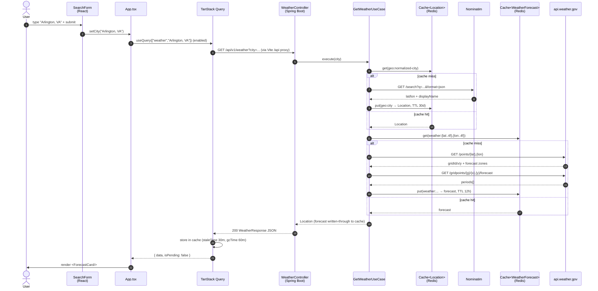
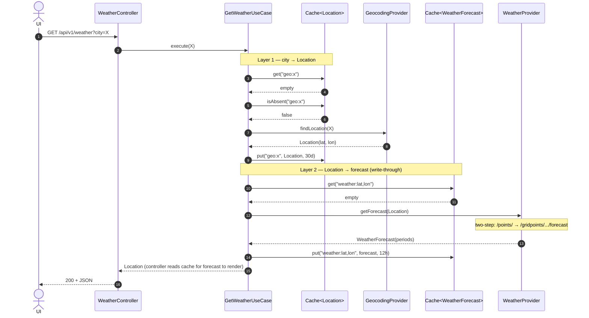
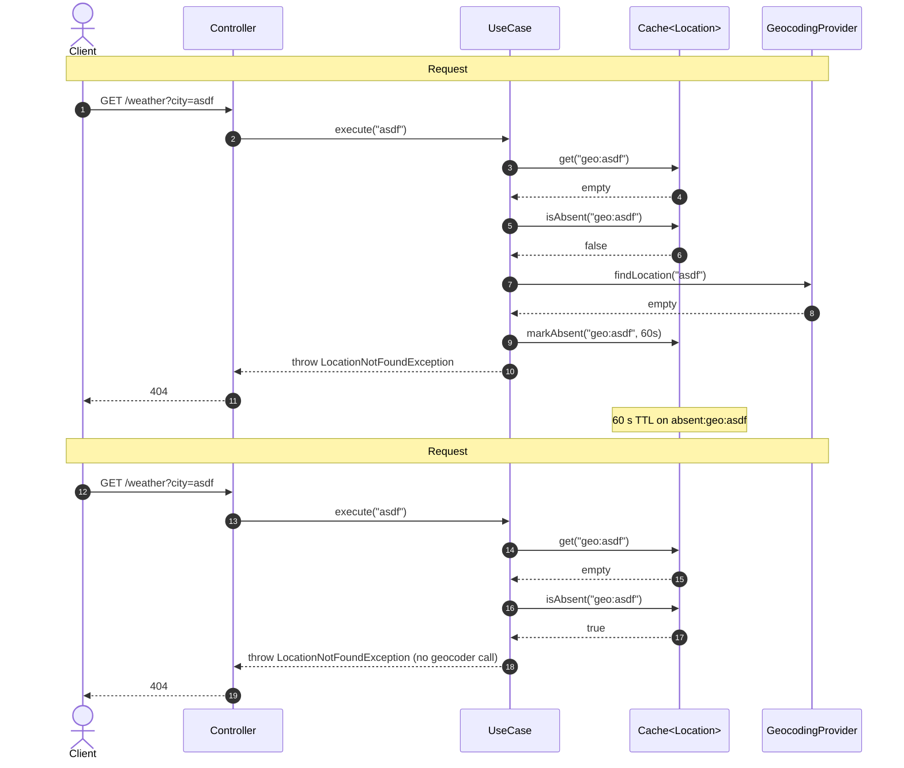

# Use case sequences

Trace each use case as a sequence diagram — the dependency wiring and
branching are easier to follow visually than reading the code alone.
As new use cases land in `weather-application/`, add a sub-section here
following the same pattern: happy-path diagram + path matrix + (optional)
focused diagrams for tricky branches.

## End-to-end UI request

Single submit → forecast rendered. Three cache layers along the way:
**TanStack Query** in the browser (keyed on city, 30 min), **Redis** in
the backend (geocoding 30 d + weather 12 h, plus negative caching on
misses), and **NWS** upstream (we don't cache NWS responses — Redis
backs the *wrapper's* responses).

### Cache matrix

| Layer | Key | TTL | Hit effect |
|---|---|---|---|
| TanStack Query | `["weather", city]` | staleTime 30 min / gcTime 60 min | Instant re-render, no network |
| `Cache<Location>` (Redis) | `geo:{normalized-city}` | 30 d | Skips Nominatim |
| `Cache<Location>` (Redis) | `absent:geo:{normalized-city}` | 60 s | Skips Nominatim, returns 404 |
| `Cache<WeatherForecast>` (Redis) | `weather:{lat:.4f},{lon:.4f}` | 12 h | Skips both NWS calls |

## `GetWeatherUseCase`

Resolves a city name to a `Location`, then resolves that `Location` to a
`WeatherForecast`. Two-layer cache-aside with negative caching on the
geocoding layer. The code lives in
`backend/weather-application/.../usecase/GetWeatherUseCase.java`.

**Participants** (collaborators injected via constructor):

| Symbol | Role |
|---|---|
| `GeocodingProvider` | Port to Nominatim (city → Location) |
| `WeatherProvider` | Port to NWS (Location → forecast) |
| `Cache<Location>` | Redis, both positive (`geo:*`) and negative (`absent:geo:*`) entries |
| `Cache<WeatherForecast>` | Redis, positive (`weather:*`) entries |

### Happy path: cold cache

Both caches miss on the first request for an unseen city. Every
collaborator is exercised — the most informative single diagram.

### Path matrix

Every legal path through `execute(city)`. Use this as the source of
truth for "what happens if X" questions before reading the code.

| Scenario | `Cache<Location>.get` | `Cache<Location>.isAbsent` | Geocoder | `Cache<WeatherForecast>.get` | Weather | Result |
|---|---|---|---|---|---|---|
| Cold cache (above) | empty | false | called → Location | empty | called → forecast | 200 forecast |
| Geo cached, weather cached | hit | — | — | hit | — | 200 forecast |
| Geo cached, weather miss | hit | — | — | empty | called → forecast | 200 forecast |
| Geo miss → fresh, weather cached | empty | false | called → Location | hit | — | 200 forecast |
| City not found, first time | empty | false | called → empty (markAbsent) | — | — | 404 |
| City not found, within absent TTL | empty | true | — | — | — | 404 (from cache) |
| City not found, after absent TTL | empty | false | called again | — | — | 404 + re-mark |
| NWS down (any cache state) | (varies) | (varies) | (varies) | empty | throws | 502 |
| Blank / null `city` param | — | — | — | — | — | 400 (validation) |

### Negative caching — protecting Nominatim

How the absent-cache layer turns a bad-city flood (typos, scanner probes,
scripted abuse) into a one-shot cost. Two requests for the same
unknown city within 60 s; the second one never reaches Nominatim.

